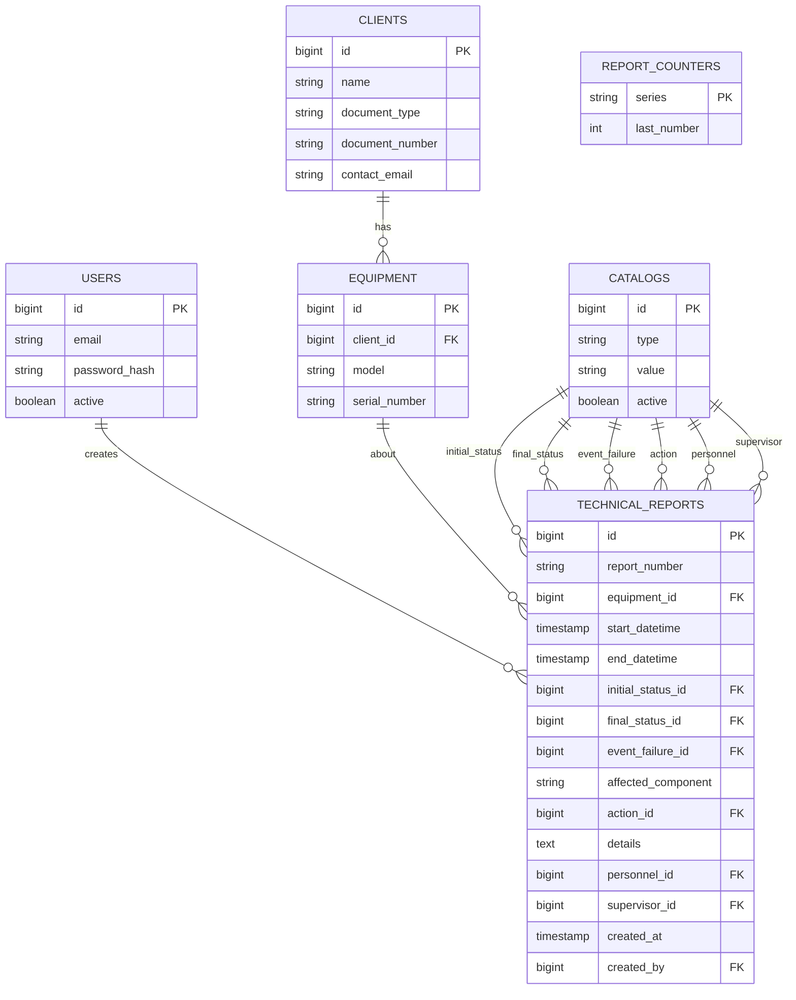

# Design Doc — Sistema de Informes Técnicos (Scontrol Ingeniería)

## 1. Objetivo

Reemplazar el llenado manual en Excel de "Informes Técnicos" de mantenimiento de equipos
(radiocontrol, video, anticolisión, pesaje, antifatiga, seguridad para puentes grúa) por
una API que permita registrar informes, mantener catálogos configurables, y generar el
documento final (PDF/Word) con el mismo formato que usa la empresa hoy.

**Usuarios:** 1-2 personas (uso interno, sin necesidad de roles granulares).
**Escala:** baja (decenas/cientos de informes, no miles por día).
**Arquitectura:** monolito simple en capas (controller → service → repository). Nada de
microservicios ni monolito modular — no se justifica a esta escala.

## 2. Alcance

### Dentro del alcance (MVP)
- Login simple (1-2 usuarios)
- CRUD de Clientes
- CRUD de Equipos (asociados a un cliente)
- Catálogos configurables (Acción, Estado, Evento/Falla, Personal, Responsable)
- CRUD de Informes Técnicos con numeración correlativa automática
- Generación del informe en PDF/Word con el formato original

### Fuera de alcance (agregar después, solo si se necesita)
- Adjuntos / evidencia fotográfica
- Dashboard con filtros avanzados
- Notificaciones por email al cliente
- Historial de cambios / auditoría
- Roles y permisos granulares
- Multi-tenancy

## 3. Stack tecnológico

| Capa | Tecnología |
|---|---|
| Lenguaje / Framework | Java 21+, Spring Boot 4 |
| Seguridad | Spring Security + JWT con `spring-boot-starter-security-oauth2-resource-server` (Nimbus JOSE) |
| Persistencia | Spring Data JPA |
| Base de datos | PostgreSQL |
| Generación de documentos | Apache POI (Word) y/o OpenPDF (PDF) — iText descartado por licencia AGPL |
| Build | Maven |
| Migraciones de BD | Flyway (recomendado desde el inicio, evita dolores de cabeza después) |
| Tests | JUnit 5 + Testcontainers (PostgreSQL real, sin H2) |

## 4. Arquitectura de capas

```
com.scontrol.technicalreports
├── config/          # Seguridad, CORS, beans generales
├── controller/       # REST controllers (un controller por módulo)
├── service/           # Lógica de negocio
├── repository/       # Spring Data JPA repositories
├── model/ (entity)   # Entidades JPA
├── dto/              # Request/Response DTOs
├── mapper/            # Entity <-> DTO (manual o MapStruct)
├── exception/         # Manejo centralizado de errores
└── document/          # Generación de PDF/Word (Apache POI / OpenPDF)
```

## 5. Modelo de datos

*Nombres de tablas y campos en inglés (convención estándar del código); las notas y
descripciones se mantienen en español.*

*Columna "Nulo": `No` = `NOT NULL`. Las longitudes se validan también en los DTOs con
Bean Validation (`@Size`, `@Email`, `@Pattern`) para devolver 400 en vez de un error de BD.*

### Tabla `users`
| Campo | Tipo | Nulo | Notas |
|---|---|---|---|
| id | BIGSERIAL | No | PK |
| email | VARCHAR(254) | No | UNIQUE, se usa como usuario de login. Se guarda en minúsculas |
| password_hash | VARCHAR(100) | No | BCrypt (60 caracteres; margen para prefijo `{bcrypt}`) |
| active | BOOLEAN | No | default true |

*El email es el nombre de usuario: no hay un campo `username` aparte. 254 es la longitud
máxima de una dirección de correo válida.*

### Tabla `clients`
| Campo | Tipo | Nulo | Notas |
|---|---|---|---|
| id | BIGSERIAL | No | PK |
| name | VARCHAR(200) | No | razón social o nombre completo, ej. "FERREYROS" |
| document_type | VARCHAR(3) | Sí | `RUC` o `DNI` (CHECK en BD, enum en código) |
| document_number | VARCHAR(11) | Sí | UNIQUE cuando tiene valor. Solo dígitos: 11 si es RUC, 8 si es DNI (CHECK en BD) |
| contact_email | VARCHAR(254) | Sí | correo de contacto, para un futuro envío del informe por email |

*`document_type` + `document_number` reemplazan a `tax_id`: el cliente puede ser una
empresa (RUC, 11 dígitos) o una persona natural (DNI, 8 dígitos). Ambos son opcionales,
pero van juntos: o se informan los dos o ninguno (CHECK en BD). Otros documentos (ej.
carné de extranjería) quedan fuera de alcance; agregarlos es ampliar el CHECK y el enum.
`contact_email` es opcional porque el envío de correos no es parte del MVP; si en el
futuro se necesitan varios contactos por cliente, se moverá a una tabla aparte.*

### Tabla `equipment`
| Campo | Tipo | Nulo | Notas |
|---|---|---|---|
| id | BIGSERIAL | No | PK |
| client_id | BIGINT | No | FK -> clients.id |
| model | VARCHAR(100) | No | ej. "777 SPECTRUM2" |
| serial_number | VARCHAR(255) | Sí | texto libre, admite varios N/S, ej. "777 - 19 00160 / 777 - 19 00161" |

*Un equipo representa el sistema completo (ej. transmisor + receptor), no cada
componente. Por eso `serial_number` es texto libre, sin UNIQUE, y puede contener varios
números de serie, igual que el campo N/S del Excel original. Todo equipo pertenece a un
cliente.*

### Tabla `catalogs` (reemplaza Hoja2 completa)
| Campo | Tipo | Nulo | Notas |
|---|---|---|---|
| id | BIGSERIAL | No | PK |
| type | VARCHAR(20) | No | ENUM lógico: ACTION, STATUS, EVENT_FAILURE, PERSONNEL, SUPERVISOR |
| value | VARCHAR(150) | No | ej. "Mantenimiento Correctivo" |
| active | BOOLEAN | No | default true; permite desactivar sin borrar histórico |

*UNIQUE (`type`, `value`). Una sola tabla genérica en vez de 5 tablas separadas — agregar
una opción nueva es un INSERT, no un cambio de código.*

### Tabla `technical_reports`
| Campo | Tipo | Nulo | Notas |
|---|---|---|---|
| id | BIGSERIAL | No | PK |
| report_number | VARCHAR(20) | No | UNIQUE, ej. "008-0001", generado automáticamente |
| equipment_id | BIGINT | No | FK -> equipment.id (el cliente se obtiene a través del equipo) |
| start_datetime | TIMESTAMP | Sí | el Excel original solo registra la fecha de término |
| end_datetime | TIMESTAMP | No | CHECK `end_datetime >= start_datetime` (solo si hay inicio) |
| initial_status_id | BIGINT | No | FK -> catalogs.id (type=STATUS), estado al INICIO |
| final_status_id | BIGINT | No | FK -> catalogs.id (type=STATUS), estado al TÉRMINO |
| event_failure_id | BIGINT | No | FK -> catalogs.id (type=EVENT_FAILURE) |
| affected_component | VARCHAR(255) | Sí | texto libre, ej. "Transmisor Spectrum 2 / receptor FSE777" |
| action_id | BIGINT | No | FK -> catalogs.id (type=ACTION) |
| details | TEXT | No | descripción larga de lo realizado |
| personnel_id | BIGINT | No | FK -> catalogs.id (type=PERSONNEL) |
| supervisor_id | BIGINT | No | FK -> catalogs.id (type=SUPERVISOR) |
| created_at | TIMESTAMP | No | default now() |
| created_by | BIGINT | No | FK -> users.id |

*No hay `client_id`: el cliente del informe es siempre el del equipo, lo que evita que un
informe quede asociado a un cliente distinto al de su equipo.*

### Tabla `report_counters`
| Campo | Tipo | Nulo | Notas |
|---|---|---|---|
| series | VARCHAR(10) | No | PK, ej. "008" |
| last_number | INTEGER | No | último correlativo emitido, inicia en 0 |

*Una sola fila (serie `008`) insertada por la migración inicial. Es la fuente del prefijo
del número de informe; cambiar de serie es un UPDATE, no un cambio de código.*

### Diagrama ER (Mermaid)



## 6. Endpoints API

### Auth
| Método | Ruta | Descripción |
|---|---|---|
| POST | `/api/auth/login` | Recibe `email` y `password`, retorna JWT |

### Clients
| Método | Ruta | Descripción |
|---|---|---|
| GET | `/api/clients` | Listar |
| GET | `/api/clients/{id}` | Detalle |
| POST | `/api/clients` | Crear |
| PUT | `/api/clients/{id}` | Editar |
| DELETE | `/api/clients/{id}` | Eliminar |

### Equipment
| Método | Ruta | Descripción |
|---|---|---|
| GET | `/api/clients/{clientId}/equipment` | Listar los equipos de un cliente |
| POST | `/api/clients/{clientId}/equipment` | Crear equipo para el cliente (`clientId` se toma de la ruta, no del body) |
| GET | `/api/equipment/{id}` | Detalle |
| PUT | `/api/equipment/{id}` | Editar |
| DELETE | `/api/equipment/{id}` | Eliminar |

*Anidamiento superficial: solo la colección va bajo el cliente. Las operaciones sobre un
equipo concreto usan `/api/equipment/{id}` porque el `id` ya es único y los informes
referencian al equipo directamente. La ruta es `equipment` (sin plural, sustantivo
incontable en inglés).*

### Catalogs
| Método | Ruta | Descripción |
|---|---|---|
| GET | `/api/catalogs?type=ACTION` | Listar por tipo |
| POST | `/api/catalogs` | Crear opción nueva |
| PUT | `/api/catalogs/{id}` | Editar / desactivar |

### Technical Reports
| Método | Ruta | Descripción |
|---|---|---|
| GET | `/api/technical-reports` | Listar (filtros: `clientId` vía el equipo, `equipmentId`, rango de fechas) |
| GET | `/api/technical-reports/{id}` | Detalle |
| POST | `/api/technical-reports` | Crear (genera número correlativo automáticamente) |
| PUT | `/api/technical-reports/{id}` | Editar |
| GET | `/api/technical-reports/{id}/document` | Descarga el PDF/Word generado |

## 7. Lógica de negocio clave

**Numeración correlativa:** al crear un informe se genera el siguiente número en
formato `<serie>-<correlativo>`, ej. `008-0001`.

- **Serie fija:** una sola serie para toda la empresa (`008`), guardada en
  `report_counters`. Todos los informes comparten el mismo correlativo; no se reinicia
  por año ni se separa por línea de producto.
- **Sin saltos:** en la misma transacción que inserta el informe se hace
  `SELECT ... FOR UPDATE` sobre la fila de `report_counters`, se incrementa
  `last_number` y se guarda el informe. Si la creación falla, el rollback revierte también
  el contador y el número no se consume. No se usa una `SEQUENCE` de PostgreSQL porque
  deja saltos ante rollbacks.
- **Formato:** correlativo con relleno mínimo de 4 dígitos. Al superar 9999 sigue
  creciendo sin error (`008-9999` → `008-10000`).
- **Integridad:** `report_number` tiene restricción `UNIQUE` como red de seguridad.

**Generación de documento:** al llamar `/api/technical-reports/{id}/document`, el servicio debe
tomar los datos del informe (cliente, equipo, catálogos resueltos, detalle) y rellenar
una plantilla Word/PDF con el mismo layout que la plantilla Excel original (cabecera
"INFORME TÉCNICO" con N°, datos del equipo: cliente, modelo y N/S, fechas, estado al
inicio y al término, evento/falla con el componente afectado, acción, detalle, firmas de
técnico y responsable).

## 8. Seguridad

- Login simple con JWT (expiración razonable, ej. 8-12 horas).
- JWT implementado con `spring-boot-starter-security-oauth2-resource-server`: el endpoint de
  login emite el token con `NimbusJwtEncoder` y la validación la hace el resource server
  con `NimbusJwtDecoder`, ambos con clave simétrica HS256. No se usa jjwt ni filtros JWT
  propios.
- La clave secreta del JWT se lee de una variable de entorno (ej. `JWT_SECRET`), nunca
  hardcodeada en el repo.
- Password hasheado con BCrypt, nunca en texto plano.
- **Usuario inicial:** se crea al arrancar la app. Si la tabla `users` está vacía, se
  inserta un usuario con `ADMIN_EMAIL` y `ADMIN_PASSWORD` leídos de variables de
  entorno, con la contraseña hasheada con BCrypt. Si la tabla ya tiene usuarios, no hace
  nada. No se guarda ningún usuario ni hash en las migraciones ni en el repo.
- Si las variables no están definidas y la tabla está vacía, la app arranca igual pero
  registra un warning (nadie podrá hacer login hasta configurarlas).
- No hay registro público. El segundo usuario, si se necesita, se agregará después
  (fuera de la Fase 1).
- No se requiere control de roles (ambos usuarios tienen el mismo nivel de acceso).

## 9. Estrategia de tests

- Tests de integración con **Testcontainers** levantando un PostgreSQL real, para que
  las migraciones Flyway y las consultas se prueben contra el mismo motor que producción.
  No se usa H2.
- Se usa `@ServiceConnection` sobre un `PostgreSQLContainer` compartido para configurar
  el datasource automáticamente en los tests.
- Requisito: Docker activo en la máquina donde se ejecuta `./mvnw test`.

## 10. Fases de desarrollo sugeridas

**Fase 1 — Base**
1. Setup del proyecto (Spring Boot 4, dependencias, conexión a BD, Flyway)
2. Entidades + migraciones de las 6 tablas (incluye `report_counters` con la serie `008`)
3. Login (JWT) con usuario inicial creado desde variables de entorno

**Fase 2 — CRUD core**
4. CRUD Clientes
5. CRUD Equipos
6. CRUD Catálogos

**Fase 3 — Núcleo del sistema**
7. CRUD Informes + lógica de numeración correlativa
8. Generación de documento (PDF/Word)

**Fase 4 — Opcional (solo si se pide)**
9. Adjuntos/evidencia fotográfica
10. Dashboard con filtros
11. Notificaciones por email

## 11. Notas para el desarrollo con Claude Code CLI

Este documento puede usarse como contexto inicial del proyecto (ej. como `DESIGN.md` en
la raíz del repo). Sugerencia de flujo:

1. Iniciar el proyecto con Spring Initializr (Web, Security, Data JPA, Validation,
   PostgreSQL Driver, Flyway).
2. Pedir a Claude Code que implemente la Fase 1 completa antes de avanzar a la
   siguiente — permite validar que el setup y la autenticación funcionan antes de
   construir el resto.
3. Ir fase por fase, revisando y probando cada módulo antes de continuar, en vez de
   pedir todo el sistema de una sola vez.

## 12. Convenciones de código

**Documentación:** toda clase creada debe llevar un Javadoc básico (no extenso) en la
cabecera, con el autor. Ejemplo:

```java
/**
 * Servicio encargado de la gestión de informes técnicos.
 *
 * @author Roger Rojas Effio - roger.rojas@rmsolutions.pe
 */
public class TechnicalReportService {
    // ...
}
```

Aplica a entidades, DTOs, controllers, services, repositories y clases de configuración.
No se requiere Javadoc en cada método, solo la cabecera de clase describiendo su
responsabilidad y el tag `@author` con el formato `Nombre - correo` (sin `<...>`, que Javadoc
interpretaría como HTML).
