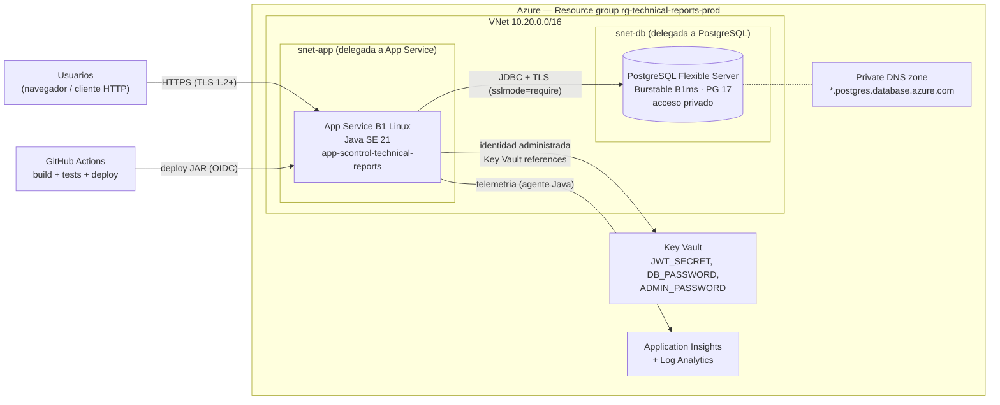

# Design Doc — Arquitectura de despliegue en Azure

## 1. Contexto

- Aplicación: API REST monolítica en Spring Boot 4 (Java 21), empaquetada como un JAR.
  Genera PDFs en memoria y no guarda archivos en disco.
- Base de datos: PostgreSQL. El esquema lo crea y actualiza Flyway al arrancar la app.
- Carga: 1-2 usuarios internos, decenas o cientos de informes. Sin picos ni requisitos de
  alta disponibilidad más allá de un horario laboral.
- Configuración 100 % por variables de entorno (`DB_*`, `JWT_SECRET`, `ADMIN_*`,
  `API_DOCS_ENABLED`).

## 2. Recomendación

**Azure App Service (Linux, stack Java SE 21) desplegando el JAR directamente**, con
**Azure Database for PostgreSQL – Flexible Server**. Coincido con priorizar App Service:

- Es PaaS gestionado: parches del sistema operativo y del runtime Java, HTTPS y
  certificados incluidos, sin contenedores ni orquestador que mantener.
- Despliega el JAR tal cual (`java -jar`), sin necesidad de registry ni imagen.
- El plan **B1** alcanza de sobra para 1-2 usuarios y permite *Always On*, que evita el
  arranque en frío de la JVM tras periodos de inactividad.
- Integración nativa con Key Vault, identidades administradas, VNet y Application Insights.

### Alternativas consideradas

| Opción | Por qué no (para este caso) |
|---|---|
| **Azure Container Apps** | Más barato si escala a cero, pero cada arranque en frío de la JVM tarda varios segundos y añade registry e imagen. Buena opción si en el futuro se contenedoriza todo |
| **AKS (Kubernetes)** | Sobredimensionado: costo y operación desproporcionados para 1-2 usuarios |
| **Máquina virtual** | Hay que parchear el SO, instalar Java, configurar HTTPS y el servicio a mano |
| **PostgreSQL en la misma VM o contenedor** | Se pierden backups automáticos, restauración a un punto en el tiempo y parches gestionados |

## 3. Arquitectura



**Flujo:** el usuario llama a la API por HTTPS. App Service lee los secretos de Key Vault
con su identidad administrada y se conecta a PostgreSQL por la VNet; la base de datos no
tiene endpoint público. GitHub Actions compila, ejecuta los tests y despliega el JAR.

## 4. Componentes y dimensionamiento

Precios aproximados en USD/mes para la región East US 2, solo como referencia: confirmar con
la [calculadora de precios de Azure](https://azure.microsoft.com/pricing/calculator/)
antes de presupuestar.

| Recurso | SKU / configuración | Notas | Costo aprox. |
|---|---|---|---|
| App Service Plan | Linux **B1** (1 vCPU, 1,75 GB) | Always On activado. Subir a S1 solo si se necesitan *deployment slots* | ~13 |
| App Service | Java SE 21, 1 instancia | HTTPS only, TLS mínimo 1.2, FTP deshabilitado | incluido |
| PostgreSQL Flexible Server | **Burstable B1ms** (1 vCore, 2 GB), PostgreSQL 17, 32 GB | Backups automáticos 7 días (ampliable a 35), acceso privado por VNet | ~15-20 |
| Key Vault | Standard, RBAC | 3-4 secretos | < 1 |
| Application Insights + Log Analytics | Basado en consumo | El volumen de esta app queda dentro o cerca del tramo gratuito | 0-5 |
| VNet + Private DNS zone | 2 subredes | La VNet no tiene costo; la zona DNS es mínima | < 1 |
| **Total estimado** | | | **~30-40** |

**Región:** East US 2 por costo. Brazil South es la alternativa más cercana a Perú, pero
cuesta más; conviene medir la latencia real desde la oficina antes de decidir. Todos los
recursos deben ir en la misma región.

**Memoria de la JVM:** con 1,75 GB, fijar `-XX:MaxRAMPercentage=70` para que la JVM use
~1,2 GB de heap en lugar del 25 % por defecto.

## 5. Seguridad

- **Secretos en Key Vault**, nunca en App Settings en texto plano ni en el repositorio. App
  Service los lee con *Key Vault references* y una identidad administrada asignada por el
  sistema, con el rol `Key Vault Secrets User`.
- **Base de datos sin acceso público:** PostgreSQL en modo *private access* dentro de
  `snet-db`; App Service llega por *VNet integration* desde `snet-app`. Conexión con
  `sslmode=require`.
- **HTTPS obligatorio**, TLS 1.2 como mínimo, FTP/FTPS deshabilitado.
- **Documentación de la API desactivada** en producción (`API_DOCS_ENABLED=false`); la
  especificación se entrega como `docs/openapi.yaml`.
- **Usuario inicial:** tras el primer arranque, rotar `ADMIN_PASSWORD` (o eliminar el
  secreto): solo se usa cuando la tabla `users` está vacía.
- **CORS:** no se configura mientras no haya un frontend web en otro dominio.
- **Dominio propio (opcional):** ej. `informes.scontrol.pe` con el certificado gestionado
  gratuito de App Service.

## 6. Configuración de la aplicación (App Settings)

| Setting | Valor |
|---|---|
| `DB_URL` | `jdbc:postgresql://psql-technical-reports.postgres.database.azure.com:5432/technical_reports?sslmode=require` |
| `DB_USERNAME` | usuario de la aplicación en PostgreSQL |
| `DB_PASSWORD` | `@Microsoft.KeyVault(SecretUri=https://kv-technical-reports.vault.azure.net/secrets/db-password/)` |
| `JWT_SECRET` | `@Microsoft.KeyVault(SecretUri=https://kv-technical-reports.vault.azure.net/secrets/jwt-secret/)` |
| `ADMIN_EMAIL` | email del primer usuario |
| `ADMIN_PASSWORD` | `@Microsoft.KeyVault(SecretUri=https://kv-technical-reports.vault.azure.net/secrets/admin-password/)` |
| `API_DOCS_ENABLED` | `false` |
| `JAVA_OPTS` | `-Duser.timezone=America/Lima -XX:MaxRAMPercentage=70` |

**Zona horaria:** App Service trabaja en UTC. Sin `-Duser.timezone=America/Lima`, la fecha
de creación de los informes y la fecha de generación del PDF saldrían 5 horas adelantadas.

**Puerto:** el stack Java SE de App Service le indica el puerto a la app y Spring Boot lo
respeta, así que no se configura. Si tras el despliegue la app no responde, revisar los
logs de arranque y, si hace falta, fijar `SERVER_PORT=80`.

**Usuario de base de datos:** crear un usuario propio para la app con permisos solo sobre
la base `technical_reports`, en lugar de usar el administrador del servidor.

## 7. Observabilidad y operación

- **Application Insights** con el agente Java de App Service (sin cambios de código):
  peticiones, tiempos de respuesta, excepciones y consultas SQL.
- **Alertas recomendadas:** errores HTTP 5xx, CPU o almacenamiento de PostgreSQL > 80 %, y
  el *health check* de App Service.
- **Logs de la app:** *Log stream* de App Service y Log Analytics.

## 8. Backups y recuperación

| Qué | Cómo | RPO / RTO orientativo |
|---|---|---|
| Base de datos | Backups automáticos de Flexible Server con restauración a un punto en el tiempo; retención de 7 días, ampliable a 35 | RPO ≈ minutos · RTO ≈ 1 h |
| Aplicación | Sin estado: se redespliega desde GitHub | RTO ≈ 15 min |
| Secretos | Key Vault con *soft delete* y protección de purga | — |

El *backup* con redundancia geográfica es opcional y encarece el servicio; para este caso
basta el backup local de la región.

## 9. CI/CD con GitHub Actions

Flujo propuesto, con aprobación manual antes de producción:

1. En cada push o pull request a `main`: `./mvnw verify`. Los tests usan Testcontainers,
   que funciona en los runners `ubuntu-latest` porque tienen Docker.
2. En `main`, tras los tests: login en Azure con **OIDC** (credencial federada; no se
   guardan secretos de Azure en GitHub).
3. Despliegue del JAR con `azure/webapps-deploy` al App Service.
4. Flyway aplica las migraciones pendientes al arrancar la nueva versión.

Con el plan B1 no hay *deployment slots*: cada despliegue reinicia la app y la deja
unos segundos sin servicio, lo que es aceptable para 1-2 usuarios. Si se necesita
despliegue sin corte, subir a S1 y usar un slot de *staging*.

## 10. Aprovisionamiento (Azure CLI, referencial)

Nombres de ejemplo; los nombres de App Service y Key Vault son globales y deben ser únicos.

```bash
RG=rg-technical-reports-prod
LOC=eastus2
APP=app-scontrol-technical-reports
KV=kv-technical-reports
PG=psql-technical-reports

az group create -n $RG -l $LOC

# Red: subred para App Service y subred delegada para PostgreSQL
az network vnet create -g $RG -n vnet-technical-reports --address-prefixes 10.20.0.0/16 \
  --subnet-name snet-app --subnet-prefixes 10.20.1.0/27
az network vnet subnet create -g $RG --vnet-name vnet-technical-reports -n snet-db \
  --address-prefixes 10.20.2.0/28 --delegations Microsoft.DBforPostgreSQL/flexibleServers

# PostgreSQL con acceso privado
az postgres flexible-server create -g $RG -n $PG -l $LOC \
  --tier Burstable --sku-name Standard_B1ms --storage-size 32 --version 17 \
  --admin-user pgadmin --admin-password '<clave-admin>' \
  --vnet vnet-technical-reports --subnet snet-db \
  --private-dns-zone $PG.private.postgres.database.azure.com \
  --database-name technical_reports --yes

# Key Vault y secretos
az keyvault create -g $RG -n $KV -l $LOC --enable-rbac-authorization true
az keyvault secret set --vault-name $KV -n jwt-secret --value "$(openssl rand -base64 48)"
az keyvault secret set --vault-name $KV -n db-password --value '<clave-usuario-app>'
az keyvault secret set --vault-name $KV -n admin-password --value '<clave-inicial>'

# App Service
az appservice plan create -g $RG -n asp-technical-reports --is-linux --sku B1
az webapp create -g $RG -p asp-technical-reports -n $APP --runtime "JAVA:21-java21"
az webapp update -g $RG -n $APP --https-only true
az webapp config set -g $RG -n $APP --always-on true --ftps-state Disabled --min-tls-version 1.2
az webapp vnet-integration add -g $RG -n $APP --vnet vnet-technical-reports --subnet snet-app

# Identidad administrada con lectura de secretos
PRINCIPAL=$(az webapp identity assign -g $RG -n $APP --query principalId -o tsv)
az role assignment create --assignee $PRINCIPAL --role "Key Vault Secrets User" \
  --scope $(az keyvault show -n $KV --query id -o tsv)
```

Después: crear el usuario de la app en PostgreSQL, cargar los App Settings de la sección 6
y conectar Application Insights desde el portal.

## 11. Cambios pendientes en la aplicación antes del despliegue

| Cambio | Motivo |
|---|---|
| Añadir Spring Boot Actuator con `/actuator/health` público | Health check de App Service: reinicia la instancia si deja de responder |
| Workflow de GitHub Actions (`.github/workflows/deploy.yml`) | Automatizar build, tests y despliegue (sección 9) |
| Usuario de BD dedicado para la app | Mínimo privilegio (sección 6) |

Ninguno bloquea un primer despliegue manual, pero se recomienda completarlos antes de
entregar el entorno de producción.
